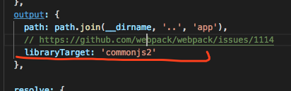

## 问题

- [服务端使用webpack打包](#1)
- [服务端打包，事件没有绑定](#2)
- [Warning: Did not expect server HTML to contain the text node "" in \<div\>.](#3)
- [服务端渲染后，客户端再次渲染导致屏幕闪屏](#4)
- [服务器渲染之后，若有componentDidMount会再次执行数据拉取 ](#5)
- [每次跳转都重新加载了资源](#6)
- [中间层做服务转发的时候，api服务器没有接受到cookie](#7)
- [服务端加载静态资源](#8)
- [服务端支持finally](#9)
- [module is not defined](#10)
- [regeneratorRuntime is not defined.](#11)
- [webpack html-webpack-plugin 设置无效](#12)
- [热更新刷新页面 redux的数据没有保留](#13)

> <span id='1'>服务端使用webpack打包</span>

```js
属性:
target 默认值web
webpack打包的环境，比如node. 
当代码中 require('path') node包时 是不会打包进bundle中
```

> <span id='2'>服务端打包,事件没有绑定：</span>
```
解决办法: 
使用同构的方式解决，服务端渲染一次页面，客户端再次渲染绑定相应事件，样式等
```

> <span id='3'>Warning: Did not expect server HTML to contain the text node "" in \<div\> </span>
```js
// 服务端渲染时不能空格
// 例如
<body>
  <div id="root"> // 这里空格了
    ${content}
  </div>
  <script src='/index.js'></script>
</body>

修改
<body>
  <div id="root">${content}</div>
  <script src='/index.js'></script>
</body>
```

react-router-dom matchPath 只能匹配第一层路由，
```js
要匹配多级嵌套路由 
使用react-router-config matchRoutes
```

> <span id='4'>服务端渲染后，客户端再次渲染导致屏幕闪屏</span>
```
原因：两端的数据不一致
方法：数据脱水与注水
```

> <span id='5'>服务器渲染之后，若有componentDidMount会再次执行数据拉取 </span>
```
可以在页面中做判断，防止客户端二次渲染，客户端会再次加载导致损失性能
```
> <span id='6'>每次跳转都重新加载了资源</div>
```
注意调试时，禁用js需要调整回来。不然会出现每次跳转路由，不是客户端渲染。
```
> <span id='7'>中间层做服务转发的时候，api服务器没有接受到cookie</span>

```
查看是否是编写错误，或者中间层获取一次cookie,在请求底层接口时在headers带上cookie
```
> <span id='8'>服务端加载静态资源</span>

第一步：webpack配置css css-loader style-loader
```js
这里重新编译后会有个问题，return window && document && document.all && !window.atob; ReferenceError: window is not defined
因为服务端没有window对象

需要分离打包
服务端打包使用isomorphic-style-loader
客户端使用style-loader
```
第二步：这里可能会有个问题浏览器禁用js时刷新页面，样式不会再显示, 可以明显看到客户端再次渲染出现抖动现象
```js
设置css服务端渲染 
两种方式：
第一种：打包抽离css，服务端渲染添加该css
第二种：服务端处理css转移成字符串，控制context反转样式（本项目采用方式）
```
第三步:后端不支持加载静态资源，开发环境添加相应钩子库
```js
// 至于 后端不支持加载静态资源，开发环境添加相应钩子库.
// 3.1. css-modules-require-hook //客户端使用的是css module https://github.com/css-modules/css-modules-require-hook
// 3.2. asset-require-hook //支持静态资源 图片等 读取
// 生成环境使用webpack打包js css 等静态资源。
// 这里当然可以使用webpack-isomorphic-tools包含以上两个模块
// 4.热更新
// webpack-dev-middleware与webpack-hot-middleware是express中间件 如果使用koa来做热更新,那么需要重新改造.(详见react-best-pratice)
// 5.动态设置页面的 title description keywords
// 6.服务端路由与客户端路由同构
// 7.构建
// 通过gulp任务，设置环境变量为production，webpack 将不会把 React 中如PropTypes检查之类的非必需代码打包，同时能够避免babel引入开发环境下的插件。
// DedupePlugin 和 UglifyJsPlugin 两个webpack插件必不可少，前者帮我们去除重复引入的js代码，后者进行js混淆压缩。
// 本次项目中，开发阶段的代码 4MB+ 最终被压缩到了 300KB，发布到CDN，浏览器以gzip格式加载，实际大小约为 100KB，即使对于移动端而言，也是一个可以接受的大小。
```

> <span id='9'>服务端支持finally，报如下异常</span>

```js
Cannot find module 'core-js/modules/es7.promise.finally'
使用 // import promiseFinally from 'promise.prototype.finally';
或者使用 try catch finally
```

> <span id='10'>module is not defined</span>
Uncaught ReferenceError: module is not defined webpack.config.base.js 中


这个配置是electron之前使用，这里为了方便直接复制过来，去掉该配置解析正常

> <span id='11'>regeneratorRuntime is not defined.</span> 

```js
// https://www.zcfy.cc/article/babel-preset-env-a-preset-that-configures-babel-for-you
使用babel-preset-env 时打包成功 但是运行时出现， 没有使用babel-polyfill 
可以不用下载 因为 env内置了该库 .babelrc 中启用

注意: node版本 也是必须的
```

> <span id='12'>webpack html-webpack-plugin 设置无效</span> 
```js
title:
没有在模板 index.html中添加  <title> <%= htmlWebpackPlugin.options.title %> </title>
favicon:

```

> <span id='13'>热更新刷新页面 redux的数据没有保留</span> 